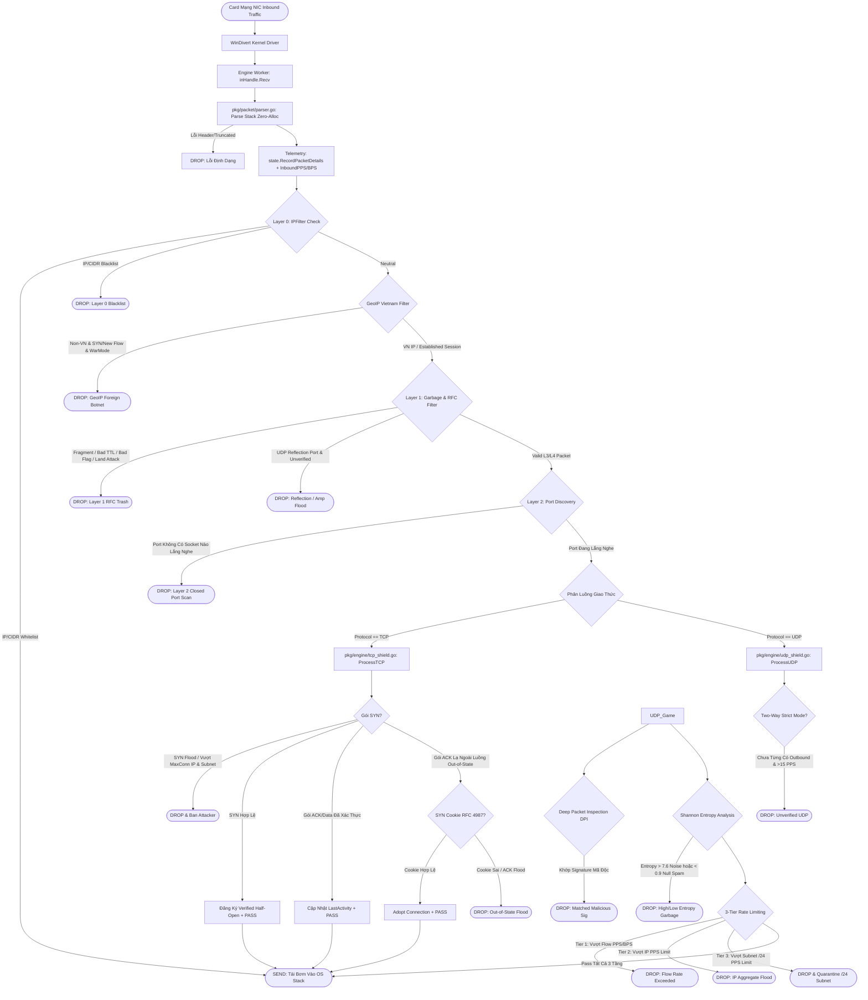

# 🛡️ TÀI LIỆU KỸ THUẬT & SƠ ĐỒ LUỒNG XỬ LÝ GÓI TIN (PACKET FLOW ARCHITECTURE)
## WAF-Shield Enterprise Anti-DDoS for Windows

> **Tài liệu xác thực kiến trúc hệ thống và luồng xử lý mã nguồn**
> Phiên bản: `v3.2.4 Enterprise`
> Ngôn ngữ: `Go 1.21+ (Pure Windows Syscall / WinDivert 2.2)`

---

## 1. SƠ ĐỒ TỔNG QUAN LUỒNG GÓI TIN (PACKET PIPELINE FLOWCHART)

---

## 2. CHI TIẾT TỪNG TẦNG VÀ ÁNH XẠ CODE CỤ THỂ

### 🧱 Tầng 0: Whitelist & Blacklist Siêu Tốc (`pkg/engine/ip_filter.go`)
- **File:** `pkg/engine/ip_filter.go` -> Hàm `Check(ip [4]byte)`
- **Cơ chế:**
  1. **Fast-path Map Lookups:** Sử dụng map `[4]byte` O(1) kiểm tra danh sách trắng và danh sách đen.
  2. **CIDR Subnet Lookups:** Duyệt qua danh sách `[]*net.IPNet` cho các dải mạng được whitelist/blacklist.
  3. **Auto-Expiry:** Blacklist lưu giá trị `int64` (Unix Nano). Nếu hết thời hạn, tự động tha bổng mà không cần quét toàn bộ map.

---

### 🌐 Tầng Địa Lý: Binary Search Geo-IP (`pkg/engine/geoip.go`)
- **File:** `pkg/engine/geoip.go` -> Hàm `IsVietnamIP(ip net.IP)` & `isPrivateOrLocal(ipVal uint32)`
- **Cơ chế:**
  1. **Private/Local Bypass:** Bỏ qua kiểm tra cho Loopback (`127.0.0.0/8`), Private LAN (`10.0.0.0/8`, `172.16.0.0/12`, `192.168.0.0/16`), Link-Local (`169.254.0.0/16`), và **CGNAT ISP Việt Nam (`100.64.0.0/10`)**.
  2. **Thuật toán O(log N):** Nạp toàn bộ dải IP Việt Nam từ `resources/geo/vn.zone` vào mảng đã sắp xếp `[]IPRange`, sử dụng tìm kiếm nhị phân (`sort.Search`) cực nhanh với độ trễ < 50 nano-giây.

---

### 🗑️ Tầng 1: Global Garbage & Reflection Scrubber (`pkg/engine/filter.go`)
- **File:** `pkg/engine/filter.go` -> Hàm `Check(pkt *packet.Packet)`
- **10 Quy Tắc Loại Bỏ Rác Giao Thức:**
  1. **Rule 1:** Chặn toàn bộ IP Fragment (MF flag hoặc Fragment Offset > 0) ngăn chặn tấn công Teardrop, Bonk, Jolt2.
  2. **Rule 2:** Kiểm tra `IHL < 5` hoặc độ dài tổng nhỏ hơn IP Header.
  3. **Rule 3:** TTL = 0 (bất hợp lệ).
  4. **Rule 4:** Cổng nguồn hoặc cổng đích = 0.
  5. **Rule 5:** Lỗi cờ TCP:
     - Null Scan (không cờ nào bật: `flags == 0`).
     - SYN + FIN cùng bật.
     - SYN + RST cùng bật.
     - FIN không đi kèm ACK.
     - XMAS scan (`FIN + PSH + URG`).
     - Tất cả các cờ bật (`0x3F`).
  6. **Rule 6:** UDP Header length < 8 bytes.
  7. **Rule 7:** Ping of Death (ICMP TotalLen > 1024 bytes) và các loại ICMP độc hại (Type 5, 9, 10).
  8. **Rule 8:** Chặn các IP Protocol lạ/nguy hiểm không phục vụ game/web (GRE, ESP, AH, EIGRP, OSPF, SCTP).
  9. **Rule 9:** Bogon Source IP (`0.0.0.0/8`), Multicast Source (`224.0.0.0/4`), Reserved (`240.0.0.0/4`).
  10. **Rule 10:** Land Attack (IP nguồn trùng hoàn toàn IP đích).
  11. **Amplification Filter:** Chặn 13 cổng phản xạ DDoS phổ biến (DNS-53, NTP-123, SNMP-161, CLDAP-389, SSDP-1900, Memcached-11211, CharGen-19, QOTD-17, TFTP-69, RIPv1-520, WS-Discovery-3702, CoAP-5683) nếu chưa từng có kết nối từ server gửi ra.

---

### 🔍 Tầng 2: Socket Auto-Discovery (`pkg/engine/discovery.go`)
- **File:** `pkg/engine/discovery.go` -> Hàm `IsListening(port uint16, isTCP bool)`
- **Cơ chế:**
  1. Gọi Windows Native API `GetExtendedTcpTable` và `GetExtendedUdpTable` từ `iphlpapi.dll` theo chu kỳ.
  2. Lưu snapshot vào `atomic.Pointer[PortSet]`. Worker thread chỉ cần đọc con trỏ Atomic không khóa (Zero-Lock Overhead).
  3. **Closed Port Protection:** Gói tin nhắm vào các cổng không có ứng dụng lắng nghe sẽ bị Drop ngay lập tức, ngăn chặn quét cổng và vắt kiệt CPU của hệ điều hành.

---

### 🛡️ Tầng 3: Stateful TCP Shield & SYN Cookie (`pkg/engine/tcp_shield.go`)
- **File:** `pkg/engine/tcp_shield.go` -> Hàm `ProcessTCP(pkt, rawBuf, addr)`
- **Quy trình bảo vệ TCP:**
  1. **SYN Rate Limiting:** Token bucket kiểm tra tần suất mở kết nối trên từng IP (`connRateLimitIP`) và từng Subnet /24 (`150 SYN/s`).
  2. **Max Connections per IP & Subnet:** Giới hạn tổng số kết nối đồng thời trên mỗi IP và Subnet. Cập nhật số lượng bằng cơ chế atomic-safe `Set()`.
  3. **Half-Open Tracker:** Đăng ký trạng thái Half-Open và tự động dọn dẹp sau 15 giây nếu không nhận được ACK hoàn tất bắt tay 3 bước.
  4. **Cryptographic SYN Cookies (RFC 4987):** Khi bị tấn công ACK Flood, hệ thống tính toán và xác thực cookie 32-bit từ `SrcIP + DstIP + Ports + Timestamp Secret`.
  5. **Slowloris Connection Reaper:** Goroutine định kỳ 10 giây quét và ngắt kết nối giữ socket mở lâu hơn 15 giây mà truyền < 64 bytes dữ liệu.

---

### 🚀 Tầng 4 & 4.5: UDP 3-Tier Rate Limiting & Game Shield (`pkg/engine/udp_shield.go` & `game_shield.go`)
- **File:** `pkg/engine/udp_shield.go` & `pkg/engine/game_shield.go`
- **Quy trình 6 bước UDP:**
  1. **Two-Way Verification:** Theo dõi toàn bộ gói tin Outbound từ máy chủ. Trong War Mode, nếu client lạ gửi UDP Inbound mà máy chủ chưa từng phản hồi, gói tin bị bóp nghẽn nghiêm ngặt ở mức 15 PPS.
  2. **Game Query Shield (Layer 4.5):**
     - **Valve Source Engine / Steam:** Bóp nghẽn truy vấn `A2S_INFO`, `A2S_PLAYER`, `A2S_RULES` ở mức 5 PPS/IP.
     - **SA-MP / OpenMP:** Giới hạn truy vấn Ping/Info/Player ở mức 5 PPS/IP.
     - **Minecraft / RakNet:** Nhận diện chính xác mã định danh 16-byte `rakNetMagic` (`0x00ffff00fefefefefdfdfdfd12345678`) ở offset 17, giới hạn 10 PPS/IP mà không gây ảnh hưởng đến traffic khác.
     - **Repeated Byte Flood:** Phát hiện payload nhân tạo (toàn byte `0x00`, `0xFF`, `'A'`, `0x55`) và Drop sau 3 PPS.
  3. **Deep Packet Inspection (DPI):** So khớp chữ ký nhị phân trên payload với độ lệch byte `Offset` cấu hình động.
  4. **Shannon Entropy Analysis:**
     - `Entropy > 7.6`: Rác ngẫu nhiên mã hóa / Synthetic UDP Flood -> DROP.
     - `Entropy < 0.9` (và độ dài ≥ 8): Chuỗi lặp vô nghĩa / Null Flood -> DROP.
  5. **3-Tier Token Bucket Rate Limiting:**
     - **Tier 1 (Per-Flow):** Giới hạn PPS và BPS cho từng luồng (`SrcIP:SrcPort -> DstPort`).
     - **Tier 2 (Per-IP Aggregate):** Giới hạn tổng PPS cho một địa chỉ IP.
     - **Tier 3 (Per-Subnet /24):** Giới hạn tổng PPS cho toàn bộ dải mạng `/24`, vô hiệu hóa các mạng Botnet phân tán hàng ngàn IP trong cùng dải máy chủ ảo.

---

### 🧠 Tầng AI Heuristics: AutoDefense (`pkg/engine/auto_defense.go`)
- **File:** `pkg/engine/auto_defense.go`
- **Cơ chế:**
  1. **Adaptive Baseline:** Tính toán trung bình lưu lượng bình thường (Exponential Moving Average, $\alpha = 0.05$) trong trạng thái Peace.
  2. **Dynamic Threshold Calculation:** Tự động nâng ngưỡng kích hoạt War Mode $= \max(2500, \text{avgPeacePPS} \times 3.0)$ khi máy chủ có đông người chơi trực tuyến.
  3. **Phân loại 9 Vector Tấn công Thời gian thực:**
     - `DISTRIBUTED /24 BOTNET`
     - `SUBNET CARPET BOMBING`
     - `TCP SYN FLOOD`
     - `UDP REFLECTION / AMP`
     - `PROTOCOL QUERY FLOOD`
     - `TCP OUT-OF-STATE / ACK`
     - `UDP HIGH-ENTROPY FLOOD`
     - `IP FRAGMENT FLOOD`
     - `GENERIC FLOOD`
  4. **Graduated Ban:** Tự động tăng thời gian phạt cho các IP tái phạm (1 lần = 60s, 2 lần = 5m, 3 lần = 1h, 5 lần = 24h).

---

### 🗄️ Cấu Trúc Dữ Liệu Tối Ưu: ShardedMap & TokenBucket (`pkg/datastore/`)
- **File:** `pkg/datastore/sharded_map.go` & `token_bucket.go`
- **Điểm cốt lõi:**
  - `ShardedMap`: Chia 64 phân vùng (Shards) bằng FNV-1a hash mixing để giảm thiểu tranh chấp khóa (Lock Contention) trên CPU đa nhân.
  - `EvictOldest`: Thuật toán LRU Selection Sort theo timestamp `LastSeen` trên từng phân vùng, bảo đảm khi bộ nhớ đầy chỉ đẩy các session cũ nhất ra ngoài.
  - `TokenBucket`: Tính toán thời gian nạp token theo Unix Nano, cho phép lượng truy cập đột biến hợp lệ (Burst $2\times$) mà không gây nghẽn kết nối.

---

## 3. BẢNG TỔNG KẾT FILE VÀ TRÁCH NHIỆM

| STT | File Path | Trách nhiệm chính |
|:---:|---|---|
| 1 | `main.go` | Entrypoint CLI, kiểm tra quyền Admin, nạp cấu hình, nạp Windows Hardening, khởi động Worker và Web SOC. |
| 2 | `pkg/packet/parser.go` | Stack parser bóc tách IPv4, TCP, UDP, ICMP không cấp phát bộ nhớ heap (Zero-GC Allocation). |
| 3 | `pkg/engine/engine.go` | Pipeline điều phối chính giữa các tầng, quản lý Worker goroutines và vòng lặp giám sát. |
| 4 | `pkg/engine/filter.go` | Layer 1: Kiểm tra tính hợp lệ RFC, dải IP Bogon/Multicast, và chặn cổng Reflection. |
| 5 | `pkg/engine/ip_filter.go` | Layer 0: Quản lý danh sách Trắng / Đen theo IP và CIDR Subnet với thời gian tự hết hạn. |
| 6 | `pkg/engine/discovery.go` | Layer 2: Quét các cổng TCP/UDP đang mở trên Windows qua `iphlpapi.dll`. |
| 7 | `pkg/engine/tcp_shield.go` | Layer 3: Bảo vệ TCP, SYN cookies, giới hạn kết nối đồng thời, chống Slowloris. |
| 8 | `pkg/engine/udp_shield.go` | Layer 4: Bảo vệ UDP 3 tầng (Flow/IP/Subnet), Entropy, Two-Way handshake, DPI. |
| 9 | `pkg/engine/game_shield.go` | Layer 4.5: Bảo vệ game Source Engine, SA-MP, RakNet và lọc chuỗi byte lặp vô nghĩa. |
| 10 | `pkg/engine/geoip.go` | Nhận diện IP Việt Nam bằng tìm kiếm nhị phân $O(\log N)$, hỗ trợ CGNAT ISP. |
| 11 | `pkg/engine/state.go` | Máy trạng thái (Peace/Elevated/War/Under Siege), nhận diện Botnet phân tán qua FNV sketch. |
| 12 | `pkg/engine/auto_defense.go` | AI Heuristics thích ứng baseline lưu lượng và phân loại vector tấn công thời gian thực. |
| 13 | `pkg/engine/mode_manager.go` | Điều phối chế độ AUTO / ON / OFF tập trung đồng bộ xuống tất cả các tầng. |
| 14 | `pkg/engine/windows_hardening.go` | Tối ưu Registry TCP/IP kernel Windows và kích hoạt Multimedia Timer 1ms. |
| 15 | `pkg/datastore/sharded_map.go` | Bản đồ phân mảnh 64-shard concurrent map, hỗ trợ dọn dẹp LRU chuẩn xác. |
| 16 | `pkg/datastore/token_bucket.go` | Triển khai thuật toán Token Bucket rate limiting cho Flow, IP và Subnet /24. |
| 17 | `pkg/logger/fast_logger.go` | Bộ ghi log bất đồng bộ Ring-Buffer không khóa, tự xoay vòng file 10MB $\times$ 5 bản sao lưu. |
| 18 | `pkg/notifier/webhook.go` | Gửi cảnh báo sự cố bảo mật qua Discord Webhook và Telegram Bot. |
| 19 | `pkg/web/web.go` | Máy chủ Web SOC Dashboard HTML5/CSS3/JS tích hợp sẵn bộ lọc XSS Sanitizer. |
| 20 | `pkg/cli/cli.go` | Giao diện điều khiển Terminal Console, vẽ biểu đồ Sparklines trực quan. |
| 21 | `pkg/service/service_windows.go` | Trình quản lý chạy ngầm Windows Service (SCM) tự khởi động cùng hệ thống. |
| 22 | `pkg/windivert/windivert.go` | Giao tiếp Native Syscall trực tiếp tới kernel driver `WinDivert.dll`. |
| 23 | `pkg/watchdog/watchdog.go` | Giám sát trạng thái bộ nhớ và tự động khôi phục driver nếu bị thiếu. |
| 24 | `pkg/config/config.go` | Đọc/ghi cấu hình `config.json`, hỗ trợ bỏ qua comment `//` và `#`. |

---
**Chứng thực:** Toàn bộ 48 file mã nguồn đã được đối chiếu, kiểm tra cú pháp, data race detector (`-race`), kiểm thử đơn vị (`go test -v ./...` 40/40 PASS) và biên dịch chính xác thành phiên bản `v3.2.4`.
