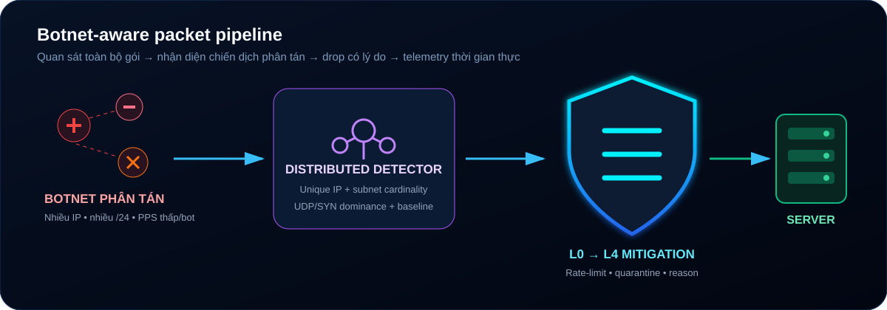

<p align="center"></p>

# WAF-Shield Enterprise v3.4 — Packet Firewall Anti-DDoS cho Windows

**WAF-Shield Enterprise** là giải pháp tường lửa và trung tâm điều hành bảo mật (SOC) chuyên dụng chống tấn công từ chối dịch vụ (**Anti-DDoS**) hoạt động trực tiếp trên nhân mạng Windows (Windows Server 2012, 2012 R2, 2016, 2019, 2022, 2025 và Windows 10, Windows 11).

Hệ thống chặn gói IPv4 qua WinDivert trước khi lưu lượng tới socket ứng dụng. Pipeline hỗ trợ Game Server UDP/TCP, web/API, RDP, SSH và database; hiệu quả thực tế phụ thuộc cấu hình, tài nguyên máy và băng thông đường truyền. Đây là lớp giảm thiểu tại host, không thay thế dịch vụ scrubbing upstream khi đường truyền đã bị bão hòa.



---

## 🌟 TÍNH NĂNG NỔI BẬT TRÊN PHIÊN BẢN v3.4

1. **📊 Giám Sát Lưu Lượng Mạng 2 Chiều Toàn Diện (Bidirectional RX & TX Telemetry)**:
   - Theo dõi song song **Lưu lượng đi vào (Inbound RX)** và **Lưu lượng phản hồi đi ra (Outbound TX)**.
   - Thống kê chi tiết cả số gói tin/giây (**PPS**) và băng thông/giây (**Bps / Mbps / Gbps**).
   - Biểu đồ nhịp sóng 60 giây thời gian thực 3 dải: **Lưu lượng sạch vào (Xanh lá)**, **Lưu lượng phản hồi ra (Xanh Cyan)**, và **Lưu lượng DDoS bị triệt tiêu (Đỏ)**.

2. **🎛️ 4 Chế Độ Phòng Thủ 1 Chạm (Instant Defense Presets)**:
   - **🌟 Full-Stack Hybrid Shield**: Chế độ tối ưu hoàn hảo cho máy chủ chạy **cả Game Server (UDP) và Website / REST API (TCP)** cùng lúc.
   - **🎮 Universal Game Server Shield**: Tối ưu chuyên sâu cho Game Server thời gian thực (**UDP Realtime**), bật bộ lọc Query Spam DPI và điều phối 120 PPS/luồng.
   - **🌐 High-Concurrency Web & API Shield**: Theo dõi trạng thái SYN/ACK, giới hạn tốc độ theo IP/subnet và dọn kết nối treo cho Web Server, REST API và WebSocket.
   - **⚔️ Maximum Lockdown Defense**: Khóa chặt máy chủ 24/7 chỉ cho phép IP Việt Nam và bật toàn bộ lớp bảo vệ nghiêm ngặt.

3. **🌍 Bộ Lọc Vị Trí Địa Lý Geo-IP Việt Nam**:
   - Tích hợp sẵn cơ sở dữ liệu `vn.zone` chứa hàng chục nghìn dải IP Việt Nam (Viettel, VNPT, FPT, CMC...).
   - Chế độ **ONLY VN**: Khóa 100% toàn bộ dải IP quốc tế chỉ với 1 click.
   - Chế độ **AUTO**: Tự động cho phép IP quốc tế khi thời bình (Peace Mode) và tự động khóa IP quốc tế khi bị bão tấn công (War Mode).
   - Tra cứu IP O(log N) bằng **Binary Search** trên dải CIDR đã tối ưu (sort & merge), không ảnh hưởng hiệu năng.

4. **🛡️ Bộ Icon 3D Cyber Shield Siêu Đẹp (Masterpiece AAA Quality)**:
   - Nhúng trực tiếp vào Win32 PE Resource của file `.exe`. Hiển thị icon 3D phát sáng sắc nét trong **Task Manager**, **Taskbar**, **Windows Explorer** và **Web SOC Dashboard**.

5. **⚡ Tự Động Nhận Diện Kết Nối (Zero-Drop TCP Adoption)**:
   - Mọi kết nối Remote Desktop (3389), Web (80, 443) hoặc Game khi gửi dữ liệu ứng dụng thực tế sẽ được đưa ngay vào danh sách tin cậy, đảm bảo không bao giờ bị rớt kết nối quản trị VPS.

6. **🔐 SYN Cookie Cryptographic (RFC 4987)**:
   - Xác thực TCP 3-way handshake bằng **HMAC-SHA256 stateless cookie** với khóa bí mật ngẫu nhiên.
   - Chống SYN Flood mà không cần lưu trạng thái — tiết kiệm bộ nhớ khi bị tấn công quy mô lớn.
   - Cửa sổ xác thực 2 phút cho phép chấp nhận ACK trễ mạng.

7. **🤖 AI Heuristics — EMA Baseline Auto-Tuning**:
   - Tự động học ngưỡng lưu lượng bình thường của máy chủ bằng **Exponential Moving Average** (hệ số α = 0.05).
   - Đề xuất ngưỡng kích hoạt War Mode động (Baseline × 3, tối thiểu 2500 PPS / 25 MB/s).
   - Phân loại véc-tơ tấn công thời gian thực: SYN Flood, Subnet Botnet, Carpet Bombing, UDP Amplification, Query Flood, TCP Out-of-State, High-Entropy Flood, Fragment Flood.

8. **⏱️ Graduated Auto-Ban — Trừng Phạt Leo Thang**:
   - IP tái phạm bị tự động tăng mức cấm: **60 giây → 5 phút → 1 giờ → 24 giờ**.
   - Theo dõi lịch sử vi phạm từng IP riêng biệt, không ảnh hưởng người dùng bình thường.

9. **🔔 Thông Báo Tấn Công Tức Thì (Discord & Telegram Webhook)**:
   - Khi phát hiện DDoS, gửi cảnh báo tự động kèm thông tin: véc-tơ tấn công, PPS/BPS đỉnh, trạng thái phòng thủ.
   - Hỗ trợ đồng thời **Discord Webhook** (embed đẹp có màu theo mức độ) và **Telegram Bot** (HTML format).
   - Chống spam bằng cooldown giữa các lần gửi (mặc định 30 giây).

10. **🔧 Windows TCP/IP Kernel Hardening**:
    - Tự động cấu hình nhân mạng Windows khi khởi động: `SynAttackProtect=2`, `EnableICMPRedirect=0`, `DisableIPSourceRouting=2`, `TcpMaxConnectRetransmissions=2`.
    - Bật **1ms High-Precision Timer** (winmm.dll) cho độ trễ gaming cực thấp.
    - Tự động khôi phục cài đặt gốc khi tắt chương trình.

11. **🐕 Watchdog — Tự Phục Hồi Driver**:
    - Đảm bảo file `WinDivert.dll` và `WinDivert64.sys` luôn sẵn sàng.
    - Tự động khôi phục nếu driver bị xóa hoặc hỏng trong khi đang chạy.

---

## 🏗️ KIẾN TRÚC MA TRẬN PHÒNG THỦ 5 LỚP

```text
               ┌────────────────────────────────────────────────────────┐
               │    LƯU LƯỢNG MẠNG TỪ INTERNET (INBOUND RX TRAFFIC)      │
               └──────────────────────────┬─────────────────────────────┘
                                          │
    [Lớp 0: IP Filter]                    ▼
    ├── Danh Sách Trắng (Whitelist) ──────────────► [CHO QUA 100%]
    └── Danh Sách Đen (Blacklist / Geo-IP) ───────► [HỦY TẠI CHỖ (DROP)]
                                          │
    [Lớp 1: RFC Scrubbing]                ▼
    └── Kiểm tra Header, Hủy gói dị dạng, Lọc phản xạ UDP (DNS 53, NTP 123...)
                                          │
    [Lớp 2: Socket Discovery]             ▼
    └── Tự động phát hiện cổng mở (1-65535), Hủy ngay gói tin gửi tới cổng đóng
                                          │
                                ┌─────────┴─────────┐
                                │                   │
                    [Lớp 3: TCP Shield]     [Lớp 4: UDP Shield]
                    ├── SYN Cookie RFC4987   ├── Token Bucket (Flow/IP/Subnet)
                    ├── Stateful SYN/ACK     ├── Anti-Carpet Bombing (/24)
                    ├── Anti-Slowloris       ├── Game Query DPI & Entropy
                    └── Kết nối đồng thời     └── Two-Way Verification
                                │                   │
                                └─────────┬─────────┘
                                          ▼
               ┌────────────────────────────────────────────────────────┐
               │             MÁY CHỦ ỨNG DỤNG / GAME SERVER              │
               └────────────────────────────────────────────────────────┘
```

---

## 🚀 HƯỚNG DẪN CÀI ĐẶT & VẬN HÀNH

Thư mục phát hành `WAF-Shield-Deploy/` đã tích hợp sẵn các file thực thi tiện lợi:

### Cách 1: Chạy Trực Tiếp Bằng Giao Diện Console & Web
* Nhấp đúp chuột vào file **`CHAY_WAF.bat`** (hoặc mở Command Prompt với quyền *Run as Administrator* và gõ `waf-game.exe`).
* Bảng điều khiển Console sẽ hiển thị đầy đủ thông số PPS, Bps, trạng thái phòng thủ.
* Mở trình duyệt truy cập: **`http://localhost:8080`** (hoặc `http://IP_VPS:8080`).

### Cách 2: Cài Đặt Chạy Ngầm 24/7 (Windows Service)
Để WAF tự động chạy ngầm bảo vệ máy chủ ngay khi VPS bật nguồn mà không cần đăng nhập Remote Desktop:
* **Bước 1**: Nhấp chuột phải vào file **`CAI_DAT_SERVICE.bat`** → Chọn **Run as Administrator**.
* **Bước 2**: Nhấp chuột phải vào file **`BAT_SERVICE.bat`** → Chọn **Run as Administrator** để khởi chạy dịch vụ.
* **Tắt dịch vụ khi cần**: Chạy file **`TAT_SERVICE.bat`**.
* **Gỡ bỏ hoàn toàn dịch vụ**: Chạy file **`GO_BO_SERVICE.bat`**.

### Cách 3: Dùng Tham Số Dòng Lệnh (CLI Flags)
```cmd
waf-game.exe                   # Chạy giao diện Console tương tác
waf-game.exe --install         # Cài đặt Windows Service
waf-game.exe --uninstall       # Gỡ bỏ Windows Service
waf-game.exe --start           # Khởi chạy Service chạy ngầm
waf-game.exe --stop            # Dừng Service đang chạy
waf-game.exe --service         # (Nội bộ) Chạy dưới dạng Windows Service daemon
```

---

## 🖥️ GIAO DIỆN WEB SOC DASHBOARD TRỰC TUYẾN (Cổng 8080)

| Tab Chức Năng | Mô Tả Chi Tiết |
| :--- | :--- |
| **Overview & Traffic** | Biểu đồ sóng thời gian thực 60 giây (RX Clean, TX Outbound, Blocked DDoS), thẻ KPI lưu lượng mạng 2 chiều, phân loại đòn tấn công. |
| **Attack Radar** | Thống kê số lượng gói tin bị chặn bởi từng lớp: Subnet /24, UDP Amplification, Query DPI, Out-of-State, Entropy. |
| **Presets & Tuning** | Kích hoạt 1 chạm 4 chế độ: Full-Stack Hybrid, Universal Game Shield, Web & API Shield, Maximum Lockdown. |
| **Access Control** | Quản lý danh sách cấm (Blacklist) và danh sách tin cậy (Whitelist), hỗ trợ thêm/xóa nhanh IP. |
| **Port Inspector** | Danh sách toàn bộ các cổng TCP/UDP đang mở trên máy chủ và lớp khiên bảo vệ tương ứng. |
| **Security Logs** | Luồng nhật ký sự kiện bảo mật trực tiếp theo thời gian thực (Live Event Stream). |

---

## ⚙️ CẤU HÌNH TÙY CHỈNH NÂNG CAO (`config.json`)

Mọi thông số đều có thể điều chỉnh linh hoạt trong file `config.json`. File hỗ trợ comment `//` và `/* */` như JavaScript:

```jsonc
{
  // Số luồng worker xử lý gói tin song song (0 = Tự động nhận diện số nhân CPU)
  "workers": 0,

  // File lưu nhật ký sự kiện bảo mật (Tự động xoay khi đạt 10MB)
  "log_file": "resources/logs/shield.log",

  // Chế độ hoạt động: "AUTO" | "WAR" | "PEACE"
  "system_mode": "AUTO",

  // ── 1. CẤU HÌNH THỜI BÌNH (PEACE MODE) ──
  "peace_mode": {
    "monitor_only": true,              // PEACE/ELEVATED chỉ quan sát
    "udp_pps_per_flow": 500,
    "udp_bps_per_flow": 5242880,
    "udp_pps_per_ip": 1500,
    "subnet_pps_limit": 5000,
    "blacklist_duration_sec": 30,
    "tcp_max_conn_per_ip": 150,
    "tcp_conn_rate_per_ip": 60,
    "tcp_max_conn_per_subnet": 500,
    "tcp_idle_timeout_sec": 90,        // Ngắt kết nối không có dữ liệu (giây)
    "enable_amplification_filter": true, // Chặn UDP reflection trong WAR
    "enable_dpi_shield": false,          // Không DPI trong PEACE
    "enable_game_shield": true           // Đo/giới hạn query game khi WAR
  },

  // ── 2. CẤU HÌNH THỜI CHIẾN (WAR MODE) ──
  "war_mode": {
    "trigger_pps": 15000,
    "trigger_bps": 52428800,
    "cooldown_sec": 60,                // Duy trì War bao lâu sau khi hết tấn công
    "udp_pps_per_flow": 250,
    "udp_bps_per_flow": 2097152,
    "udp_pps_per_ip": 600,
    "subnet_pps_limit": 2500,
    "enable_dpi": true,                // Bật DPI khi chiến
    "entropy_mode": "AUTO",            // Shannon Entropy: "AUTO" | "ON" | "OFF"
    "enable_twoway": true,             // Xác thực phản hồi 2 chiều
    "geoip_mode": "OFF",              // Giữ Steam/EOS/VoIP/quốc tế
    "strict_whitelist": true           // Whitelist không bị giới hạn tốc độ
  },

  // ── 3. TỐI ƯU BỘ NHỚ (CACHE) ──
  "cache": {
    "max_entries": 300000,             // Số bản ghi IP/luồng tối đa trong RAM
    "ttl_sec": 30,                     // Thời gian sống bản ghi không hoạt động
    "sweep_interval_sec": 10,          // Chu kỳ dọn bộ nhớ (giây)
    "shards": 64                       // Số shards tối ưu đa luồng
  },

  // ── 4. TỰ ĐỘNG PHÁT HIỆN PORT ──
  "discovery": {
    "interval_sec": 5,                 // Chu kỳ quét socket hệ thống (giây)
    "exclude_ports": []                // Port loại trừ không lọc
  },

  // ── 5. GIAO DIỆN WEB DASHBOARD ──
  "web_dashboard": {
    "enabled": true,
    "port": 8080,
    "username": "",                    // Để trống = không cần đăng nhập
    "password": "",
    "allow_lan": false                 // true = bind 0.0.0.0, yêu cầu mật khẩu ≥12 ký tự
  },

  // ── 6. THÔNG BÁO TẤN CÔNG QUA DISCORD / TELEGRAM ──
  "notifications": {
    "enabled": false,
    "discord_webhook_url": "",         // "https://discord.com/api/webhooks/..."
    "telegram_bot_token": "",          // "123456789:ABCdefGhIJKlmNoPQRstuVWXyz"
    "telegram_chat_id": "",            // "-1001234567890"
    "cooldown_sec": 30                 // Giãn cách gửi tin tránh spam
  },

  // ── 7. LUẬT TÙY BIẾN CHO PORT ĐẶC BIỆT ──
  "custom_rules": [
    // Ví dụ: Chặn query spam trên port game MU Online
    // { "port": 55901, "protocol": "udp", "name": "MU Query", "signature_hex": "C1", "allow_pps": 5 }
  ],

  // ── 8. DANH SÁCH IP TIN CẬY & DANH SÁCH ĐEN ──
  "whitelist_ips": ["127.0.0.1"],
  "blacklist_ips": []
}
```

---

## 🔔 CẤU HÌNH THÔNG BÁO DISCORD / TELEGRAM

### Discord Webhook
1. Mở Discord → Server Settings → Integrations → Webhooks → **New Webhook**.
2. Copy URL và dán vào `discord_webhook_url` trong `config.json`.
3. Bật `"enabled": true`.

### Telegram Bot
1. Nhắn `/newbot` cho **@BotFather** trên Telegram để tạo bot, lấy **Token**.
2. Lấy **Chat ID** bằng cách nhắn tin cho bot rồi truy cập `https://api.telegram.org/bot<TOKEN>/getUpdates`.
3. Điền `telegram_bot_token` và `telegram_chat_id` vào `config.json`.

Khi phát hiện DDoS, hệ thống sẽ tự động gửi cảnh báo kèm thông tin:
- 🔴 **Attack Start**: Véc-tơ tấn công, PPS/BPS đỉnh, trạng thái phòng thủ.
- 🟢 **Attack Mitigated**: Thông báo đã triệt tiêu thành công.
- 🟠 **Subnet Banned**: Dải mạng bị cách ly tự động.

---

## 📦 THÀNH PHẦN FILE GÓI TRIỂN KHAI

| File | Mô Tả |
| :--- | :--- |
| **`waf-game.exe`** | File thực thi chính (Tích hợp Web Server SOC, NDIS Engine, Tường lửa Anti-DDoS) |
| **`WinDivert.dll`** & **`WinDivert64.sys`** | Thành phần bắt và tái chèn gói trên Windows |
| **`config.json`** | File cấu hình thông số phòng thủ WAF |
| **`resources/geo/vn.zone`** | Cơ sở dữ liệu IP Việt Nam |
| **`CHAY_WAF.bat`** | Khởi chạy WAF ở chế độ Console tương tác |
| **`CAI_DAT_SERVICE.bat`** | Cài đặt Windows Service chạy ngầm |
| **`BAT_SERVICE.bat`** | Bật Windows Service |
| **`TAT_SERVICE.bat`** | Tắt Windows Service |
| **`GO_BO_SERVICE.bat`** | Gỡ bỏ hoàn toàn Windows Service |

---

## ✅ Checklist Trước Khi Đưa Vào Production

### Profile mặc định: The Isle Evrima 250 slot

Profile release dựa trên số liệu khách hàng cung cấp: tổng download khoảng 5–15 Mbps và upload 10–25 Mbps ở tối đa 250 người chơi.

- `peace_mode.monitor_only: true`: PEACE/ELEVATED chỉ đo và đánh giá, không rate-limit Steam query, gameplay, RCON, IslePilot, VoIP hoặc UltraViewer.
- AUTO chỉ enforce khi vào WAR. Detector chỉ tính TCP SYN và UDP chưa được server phản hồi; người chơi UDP đã xác thực hai chiều không bị tính là botnet.
- Ngưỡng WAR là 15.000 PPS hoặc 50 MiB/s inbound; Geo-IP để `OFF` nhằm giữ Steam/EOS, dịch vụ bên thứ ba và người chơi quốc tế.
- Host firewall không thể cứu đường truyền VNPT Home 300 Mbps khi botnet đã làm đầy đường truyền trước modem. Khi đó cần ISP/business line hoặc scrubbing upstream; router mạnh hơn không tạo thêm băng thông.

- Giữ `allow_lan: false` nếu dashboard chỉ dùng qua RDP. Nếu bật LAN, **bắt buộc** đặt `username` và mật khẩu riêng mạnh ≥ 12 ký tự; chương trình sẽ từ chối bind LAN khi thiếu thông tin xác thực.
- Thêm IP quản trị cố định vào `whitelist_ips`, nhưng không whitelist cả dải rộng.
- Bắt đầu bằng `system_mode: "AUTO"`, theo dõi `unique_source_ips`, `unique_subnets`, lý do drop và false-positive trước khi chọn `WAR` cố định.
- Kiểm thử tải trên staging với traffic giống game/API thật. Không sao chép ngưỡng PPS giữa các dịch vụ có hành vi khác nhau.
- Đặt host sau firewall/upstream DDoS protection nếu dung lượng tấn công có thể vượt băng thông NIC/ISP.
- Cấu hình Discord/Telegram webhook để nhận cảnh báo kịp thời khi có tấn công xảy ra ngoài giờ làm việc.

---

## 🧑‍💻 BUILD TỪ MÃ NGUỒN

```bash
# Yêu cầu: Go 1.23+ trên Windows

# Build file thực thi
GOOS=windows GOARCH=amd64 go build -ldflags="-s -w" -o waf-game.exe .

# Chạy unit tests (chạy được trên mọi OS)
go test ./pkg/... -v -count=1
```

---
*© 2026 WAF-Shield Enterprise Cyber Security — All Rights Reserved.*
